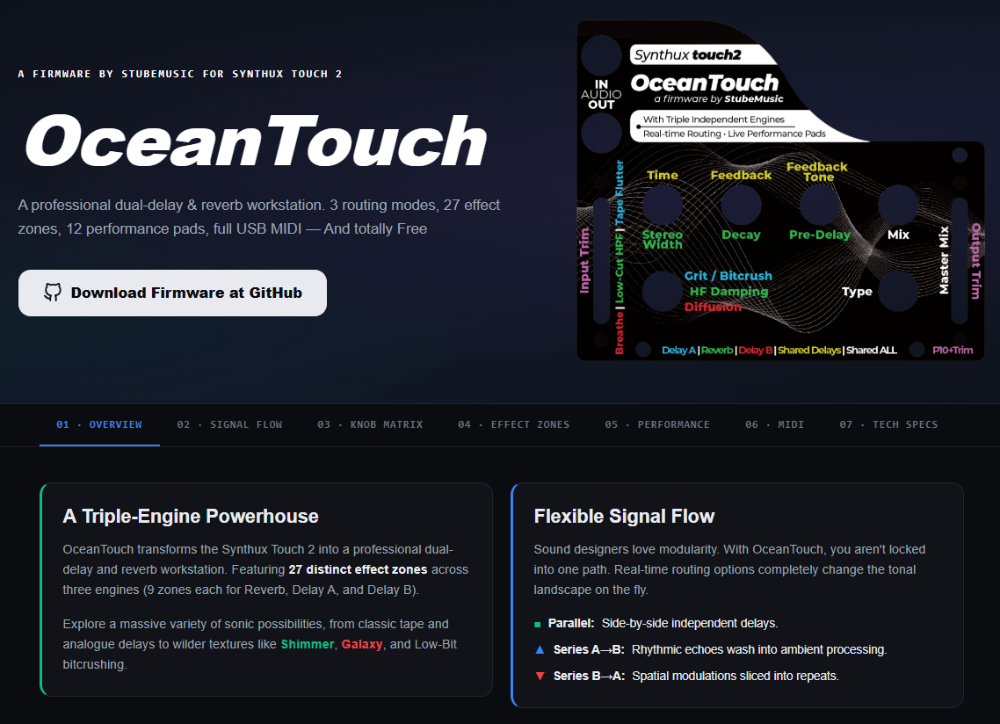
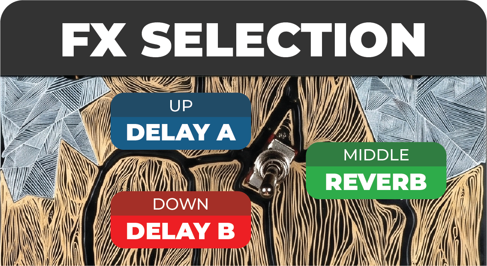
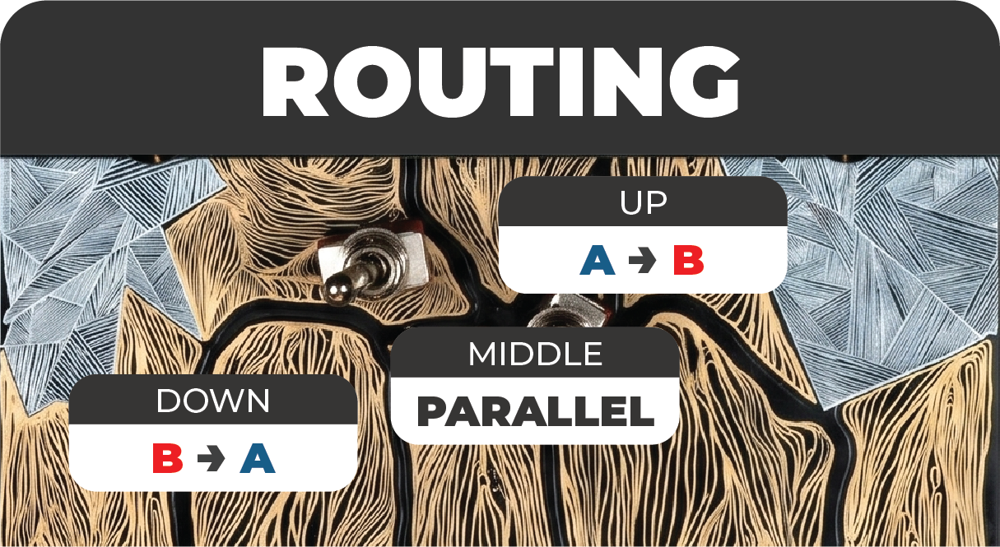

# OceanTouch Firmware for Synthux Touch 2

OceanTouch transforms the Synthux Touch 2 (powered by Daisy Seed) into a professional dual-delay and reverb workstation. Featuring 3 routing modes, 27 effect zones, 12 performance pads, and full USB MIDI class compliance.

## 📖 Interactive Web Manual

**[Explore the Interactive OceanTouch Web Manual](https://oceantouch.vercel.app/)**  
Dive into the complete web documentation to master your firmware. The interactive manual features a visual signal flow routing simulator, a fully clickable knob matrix to understand the controls, detailed breakdowns of all 27 effect zones, and a complete guide to MIDI mapping.

---

### 🌊 A Triple-Engine Powerhouse
OceanTouch features **27 distinct effect zones** across three engines (9 zones each for Reverb, Delay A, and Delay B). Explore a massive variety of sonic possibilities, from classic tape and analogue delays to wilder textures like **Shimmer**, **Galaxy**, and Low-Bit bitcrushing.

#### Effect Zones Overview

### 🔀 Flexible Signal Flow
Sound designers love modularity. With OceanTouch, you aren't locked into one path. Real-time routing options completely change the tonal landscape on the fly:
* **Parallel:** Side-by-side independent delays. Both delays run independently on the clean input and outputs are summed.
* **Series A→B:** Rhythmic echoes wash into ambient processing. Delay A's output feeds Delay B's input.
* **Series B→A:** Spatial modulations sliced into repeats. Delay B processes first, then Delay A.

### 🎛️ Expressive Live Performance & Studio Integration
Turn effects into a playable instrument. The Synthux Touch 2's **12 click-free capacitive pads** offer highly musical gestures (freezes, reverse washes, time dives) perfect for live sets. Additionally, the firmware features full USB MIDI class-compliance with **zero drivers required**, tap-tempo sync via MIDI notes, and automatic MIDI Clock detection.

## 📥 Download Firmware

You can download the latest compiled firmware binary right here in the repository:
* **[Download OceanTouch Firmware (.bin)](./OceanEngine-V1.bin)**

## 🚀 How to Install

1. Connect your Daisy Seed (inside the Synthux Touch 2) to your computer via USB.
2. Put the Daisy Seed into bootloader mode:
   - Hold the **BOOT** button on the Daisy.
   - Press the **RESET** button.
   - Release the **RESET** button.
   - Release the **BOOT** button.
3. Flash the `.bin` file using the [Daisy Web Programmer](https://electro-smith.github.io/Programmer/) or your preferred Daisy flashing tool.

---
*A firmware by StubeMusic for Synthux Touch 2*

## 🖨️ Printable Paper Templates

We provide PDF templates that are ready to print to paper and can be placed over any faceplate on the Touch 2. 
**Important: All prints should be printed without any resize, the plate should have 8.1mm width.**

* [OceanTouch-Plate-Master.pdf](./toPrint/OceanTouch-Plate-Master.pdf)
* [OceanTouch-Plate-Reverb.pdf](./toPrint/OceanTouch-Plate-Reverb.pdf)
* [OceanTouch-Plate-DelayA.pdf](./toPrint/OceanTouch-Plate-DelayA.pdf)
* [OceanTouch-Plate-DelayB.pdf](./toPrint/OceanTouch-Plate-DelayB.pdf)
